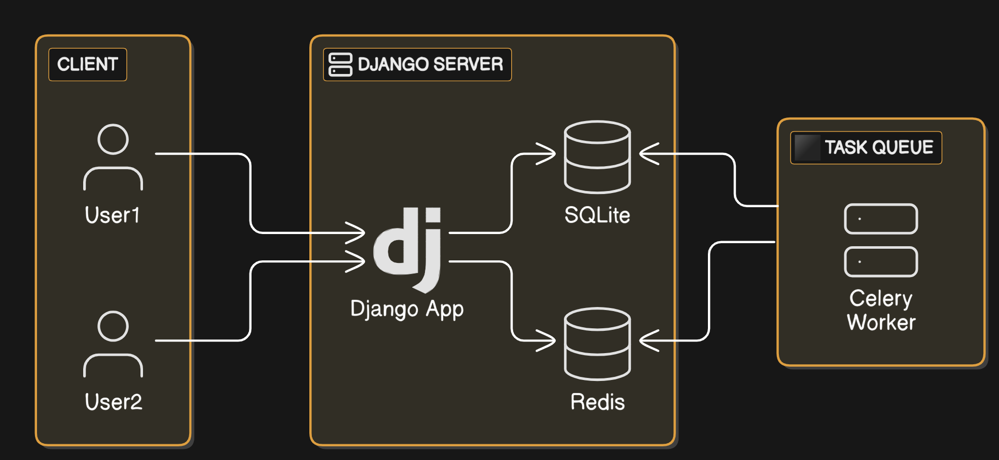
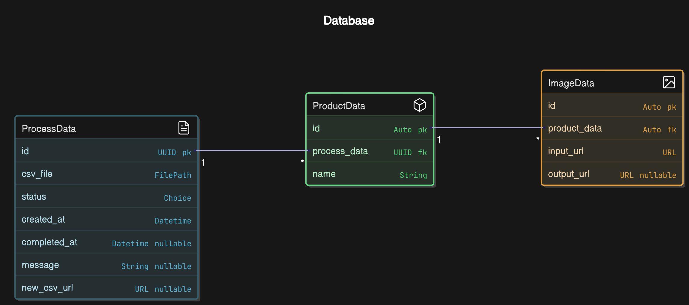

# Django CSV Processing API

This project provides an API for **uploading CSV files**, processing them asynchronously using **Celery**, and storing the results. The system uses **Redis** as a message broker**.

---

## **System Architecture**
This project follows a **microservices-based architecture** using **Django, Celery, Redis**, and **Docker**.



---

## **Database Schema**
The **database schema** represents how the models are structured in Django.



---

## **Features**
- Upload CSV files via an API endpoint.
- Process files asynchronously using Celery.
- Retrieve the status and results of the processed CSV files.
- Uses **Django**, **Celery**, **Redis**, and **Docker Compose**.

---

## **Prerequisites**
Ensure you have the following installed:
- **Docker** & **Docker Compose**
- **Python 3.x**
- **Redis** (if running locally without Docker)

---

## **Setup Instructions**

### **1. Clone the Repository**
```bash
git clone https://github.com/link.git
cd Server
```

### **2. Create an Environment File**
Create a `.env` file in the project root:

```ini
# Use this when running in Docker Compose
REDIS_HOST=redis://redis  

# Uncomment this if running without Docker
# REDIS_HOST=redis://localhost  

REDIS_PORT=6379

# Media Files
SERVER_MEDIA_URL=http://localhost:8000/media
```

### **3. Build and Start the Services**
```bash
docker-compose up --build
```

This will start:
- **Django App** at `http://localhost:8000/`
- **Redis** at `localhost:6379`
- **Celery Workers** for background tasks


### **4. Create a Superuser (Optional)**
```bash
docker-compose exec server python manage.py createsuperuser
```

---

## **API Documentation**

### **CSV Upload Endpoint**
- **URL:** `POST /core/v1/upload/`
- **Request:** Upload a CSV file.
- **Response:**
  ```json
  {
      "message": "File Uploaded.",
      "id": "1a1ff9b9-fa48-4ee0-a160-6864e5c10306"
  }
  ```

### **Process Data Status Endpoint**
- **URL:** `GET /core/v1/status/{id}/`
- **Response:**
  ```json
  {
      "id": "1a1ff9b9-fa48-4ee0-a160-6864e5c10306",
      "status": "completed",
      "new_csv_url": "http://localhost:8000/media/csv/output/processed.csv"
  }
  ```

---

## **Async Worker (Celery)**
### **Process CSV File Task**
- **Task Name:** `process_csv_file`
- **Usage:**
  ```python
  from core.tasks import process_csv_file
  process_csv_file.delay("1a1ff9b9-fa48-4ee0-a160-6864e5c10306")
  ```

- **Celery Commands:**
  ```bash
  docker-compose exec web celery -A project worker --loglevel=info
  ```


---

## **Stopping Services**
```bash
docker-compose down
```

---